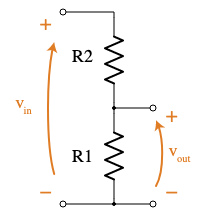
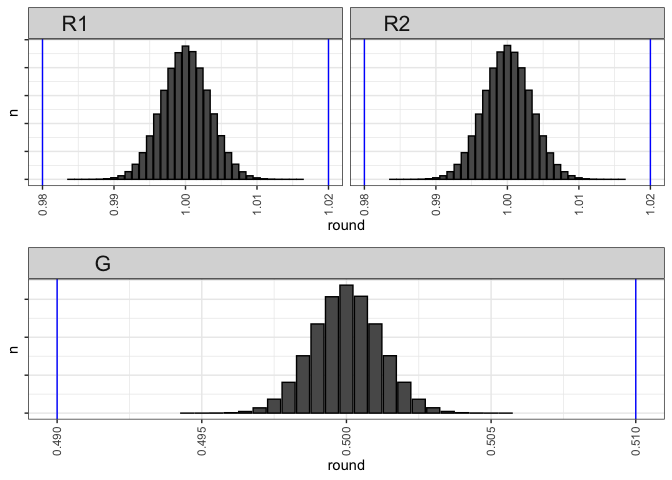
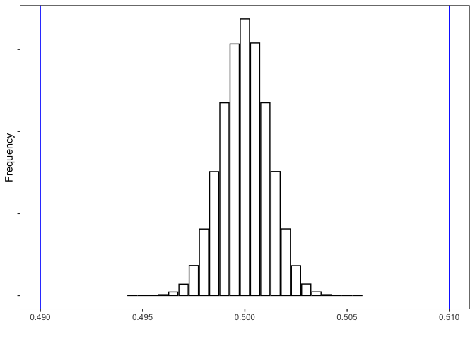
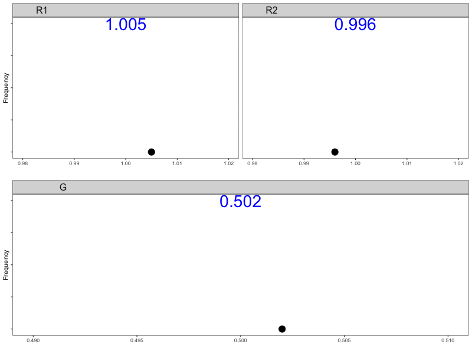
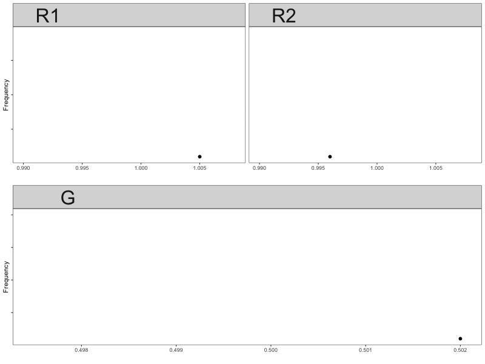
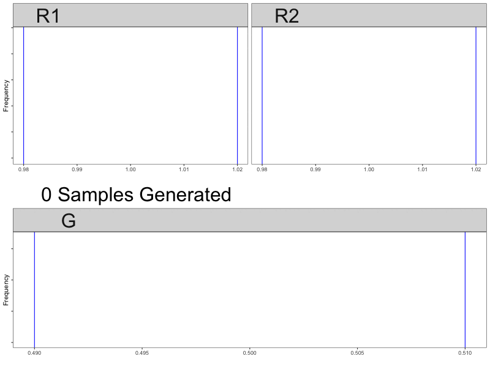

Monte Carlo simulations are a class of computational algorithms that
rely on repeated random sampling to obtain numerical results. They are
particularly useful for understanding the behavior of systems too
complex for analytical solutions. In this blog post, we’ll explore how
to visualize Monte Carlo simulations using `R`, with the help of the
`gganimate`, `tidyverse`, `gridExtra`, and `magick` packages.

## Several notes:

When using `gganimate`, the `gifski` renderer is not consistent. It may
miss frames from to time. It appears the most consistent way of
generating animation is - Use `transistion_manual` - Use `file_renderer`
to generate PNG files - Review PNG files, edit as needed. - Generate gif
with `magick` package. \## Setting the Scene To ensure reproducibility,
we set a seed for R’s random number generator. We also define the
precision of our output for clarity and consistency.

## Case Study - Tolerance Analysis.

In this example, we use a statistical tolerance analysis of the voltage
divider as an example.

 The voltage division ratio
$G = \frac{R1}{R1 + R2}$, where *R*1 and *R*2 are
independent variables following normal distributions. Our goal is to
simulate this process a million times and visualize the distribution of
G.

    N_SIM <- 1e6
    mcHist <- tibble(R1 = rnorm(N_SIM, 1, 0.04/12),
                    R2 = rnorm(N_SIM, 1, 0.04/12)) %>%
      mutate(G = R1 /(R1+R2)) %>% 
      mutate(index = row_number()) %>% 
      pivot_longer(cols = c("R1", "R2", "G"),
                   names_to = "Variable", 
                   values_to = "value") %>% 
      mutate(round = if_else(Variable == "G", 
                                 plyr::round_any(value, 5e-4),
                                 plyr::round_any(value, 1e-3)))

# Create Frequency Table

    count_by_round <-mcHist %>%
      select(Variable, round) %>%
      group_by(Variable, round) %>%
      summarise(n = n(), .groups = "drop") %>%
      ungroup()

    gplot <- count_by_round %>%
      filter(Variable == "G") %>% 
      ggplot(aes(round, n)) +
      facet_grid(~Variable) +
      geom_bar(stat = "identity", color="black") + 
      geom_vline(xintercept = 0.49, color="blue") + 
      geom_vline(xintercept = 0.51, color="blue") +
      theme_bw() + 
      theme(strip.text = element_text(size = 16, hjust = 0.1),
            axis.text.y = element_blank(),
            axis.text.x = element_text(angle=90, vjust=.5, hjust=1))

    rplot <- count_by_round %>%
      filter(Variable != "G") %>% 
      ggplot(aes(round, n)) +
      facet_grid(~Variable) +
      geom_bar(stat = "identity", color="black") + 
      geom_vline(xintercept = 0.98, color="blue") + 
      geom_vline(xintercept = 1.02, color="blue") +
      theme_bw() + 
      theme(strip.text = element_text(size = 16, hjust = 0.1),
            axis.text.y = element_blank(),
            axis.text.x = element_text(angle=90, vjust=.5, hjust=1))

Combine Plots

    # Combine plots
    plot = grid.arrange(rplot, gplot, nrow = 2)

    # alternatively, use geom_bar to generate histogram from raw data
    gg <- mcHist %>%
      filter(Variable == "G") %>%
      ggplot(aes(x=round)) + 
      geom_bar(color="black", stat = "count", alpha = .3, fill = "transparent") +
      labs(x = "", y = "Frequency") +
      theme_bw() +
      theme(panel.grid = element_blank(),
            strip.text = element_text(size = 16, hjust = 0.1),
            axis.text.y = element_blank()) +
      geom_vline(xintercept = 0.49, color="blue") + geom_vline(xintercept = 0.51, color="blue")

    gg

## Animating the Simulation

Animations can provide a dynamic view of the simulation process. Here,
we’ll create several animations to illustrate different aspects of the
Monte Carlo simulation. Preparation Slice the simulated data into
(N\_Frames — 1) slices, where the first frame has zero simulations.

    # constants for animation
    FPS = 10
    N_FRAME = 201

    count_by_index <- function(mcHist, nframes=120) {
      # Initialization of variables
      data <- tibble(idx = integer(),
                     n_sample = integer(),
                     Variable = character(),
                     round = numeric(),
                     n = integer())
      N_SIM = max(mcHist$index)
      step <- floor(N_SIM / (nframes-1))
      data <- data %>% 
        add_row(tibble(idx = 1,
                     n_sample = 0,
                     Variable = c("G","R1", "R2"),
                     round = c(0.5, 1.0, 1.0),
                     n = 0))

      for (i in 1:nframes-1) {
        # Data manipulation and summarization steps
        row <- mcHist %>%
               select(index, Variable, round) %>%
               filter(index <= step * i) %>%
               group_by(Variable, round) %>%
               summarise(n = n(), .groups = 'drop') %>%
               mutate(idx = i + 1,
                      n_sample = floor(step * i))
        # Append the summary data to the main data frame
        data <- data %>%
                add_row(row)
      }
      return(data)
    }

    hist_anim_data <- count_by_index(mcHist, N_FRAME) %>% 
      arrange(idx)

## Create Text for G and R

In this section, we will create a text gif to demonstrate the concept of
a transfer function, which takes values of x to generate corresponding
values of y.

    textplot_data <- mcHist %>% 
      filter(index<=5) %>% 
      arrange(index, Variable)
    # dot plot for first 5 samples 
    tgplot <- textplot_data %>%
      filter(Variable == "G") %>%
      ggplot(aes(group = index, x = round)) + # group by index is important
      facet_grid(~Variable) +
      geom_point(aes(y=0), size = 5, color="black") + 
      geom_text(aes(x=0.5, y=0.1, label = round), 
                    position = position_dodge(width=0.9), color="blue", size = 10) +
      labs(x = "", y = "Frequency") +
      xlim(0.49, 0.51) +
      theme_bw() +
      theme(panel.grid = element_blank(),
        strip.text = element_text(size = 16, hjust = 0.1),
        axis.text.y = element_blank()) 

    trplot <- textplot_data %>%
      filter(Variable != "G") %>%
      ggplot(aes(group = index, x = round)) + # group by index is important
      facet_grid(~Variable) +
      geom_point(aes(y=0), size = 5, color="black") + 
      geom_text(aes(x=1, y=0.1, label = round), 
                    position = position_dodge(width=0.9), color="blue", size = 10) +
      labs(x = "", y = "Frequency") +
        xlim(0.98, 1.02) +
        theme_bw() +
        theme(
          panel.grid = element_blank(),
          strip.text = element_text(size = 16, hjust = 0.1),
          axis.text.y = element_blank()
        )

### Create GIF

Use `transition_manual(frames = index)` all through to avoid frames
misalignment when using `transition_states(states = Time)`

    # Create GIF
    r_anim <- trplot + transition_manual(frames = index) 
    rgif <- animate(r_anim,
                    width = 800, height = 300,
                    nframes = 5, 
                    fps = 2.5,
                    #renderer = magick_renderer()
                    renderer = gifski_renderer("./anim/tr.gif")
                    # renderer = file_renderer("./frames", prefix = "tr")
                    )

    ## Rendering [=======================================================================================] at 25 fps ~ eta:  0s                                                                                                                        

    g_anim <- tgplot + transition_manual(frames = index)
    ggif <- animate(g_anim,
                    width = 800, height = 300,
                    nframes = 5,
                    fps = 2.5,
                    renderer = gifski_renderer("./anim/tg.gif")
                    # renderer = magick_renderer()
                    # renderer = file_renderer("./frames", prefix = "tg")
                    )

    ## Rendering [=================================>----------------------------------------------------] at 7.9 fps ~ eta:  0sRendering [===================================================>-----------------------------------] at 10 fps ~ eta:  0sRendering [=====================================================================>-----------------] at 12 fps ~ eta:  0sRendering [=======================================================================================] at 14 fps ~ eta:  0s                                                                                                                        

Combine 2 gifs

    stack2gif <- function(gif1, gif2, n_frames){
      # read gif as imageck format 
      a_mgif <- image_read(gif1) 
      b_mgif <- image_read(gif2)
      new_gif <- image_append(c(a_mgif[1], b_mgif[1]), stack = TRUE)
      for(i in 2:n_frames) {
        combined <- image_append(c(a_mgif[i], b_mgif[i]), stack = TRUE)
        new_gif <- c(new_gif, combined)
        }
    return(new_gif)  

    a_mgif <- image_read(rgif)
    b_mgif <- image_read(ggif)
    new_gif <- image_append(c(a_mgif[1], b_mgif[1]), stack = TRUE)
    for(i in 2:5) {
      combined <- image_append(c(a_mgif[i], b_mgif[i]), stack = TRUE)
      new_gif <- c(new_gif, combined)
    }
    anim_save("./anim/5dots.gif", new_gif)

    }

The created gif: 

# Create dot histogram

In this section, we create a histogram gif, where each dot represent one
data point.

    first_n = 100

    count_data_n <- mcHist %>% 
      filter(index <= first_n) %>% 
      arrange(index, Variable) %>% 
      group_by(Variable, round) %>% 
      mutate(y = seq_along(round))

    fg_plot <- count_data_n %>%
      filter(Variable == "G") %>%
      ggplot(aes(group = index, round, y)) + # group by index is important
      facet_grid(~Variable) +
      geom_point(size = 2) +
      labs(x = "", y = "Frequency") +
      theme_bw() +
      theme(
        panel.grid = element_blank(),
        strip.text = element_text(size = 32, hjust = 0.1),
        axis.text.y = element_blank()
      )

    plot2frames <- function(plot, 
                         prefix, 
                         w = 800, h = 300,
                         path_frames = "./frames"
                         ){
      anim <- plot + transition_manual(index, cumulative = TRUE)
      gif <- animate(
        anim,
        width = w,
        height = h,
        renderer = file_renderer(path_frames, prefix = prefix)
      )
      return(gif)
    } 

    fg_anim <- plot2frames(fg_plot, prefix = "gdot")

    ## Warning: file_renderer failed to copy frames to the destination directory

    fr_plot <- count_data_n %>%
      filter(Variable != "G") %>%
      ggplot(aes(group = index, round, y)) + # group by index is important
      facet_grid(~Variable) +
      geom_point(size = 2) +
      labs(x = "", y = "Frequency") +
      theme_bw() +
      theme(
        panel.grid = element_blank(),
        strip.text = element_text(size = 32, hjust = 0.1),
        axis.text.y = element_blank()
      )

    fg_anim <- plot2frames(fg_plot, prefix = "gdot")

    ## Warning: file_renderer failed to copy frames to the destination directory

    fr_anim <- plot2frames(fr_plot, prefix = "rdot")

    ## Warning: file_renderer failed to copy frames to the destination directory

    fn_gif <- stack2gif(fr_anim, fg_anim, first_n) %>% 
      image_animate(
        fps = FPS,
        loop = 0,
      )

    anim_save("./anim/fn.gif", fn_gif)

This gif shows how first N simulation accumated to form the historgram.

## Historgram bar gif

    gplot <-
      hist_anim_data %>%
      filter(Variable == "G") %>%
      ggplot(aes(group = idx, round, n)) + # group by index is important
      facet_grid(~Variable) +
      geom_bar(stat = "identity") +
      geom_vline(xintercept = 0.49, color="blue") +
      geom_vline(xintercept = 0.51, color="blue") +
      labs(x = "", y = "Frequency") +
      theme_bw() +
      theme(panel.grid = element_blank(),
            strip.text = element_text(size = 32, hjust = 0.1),
            plot.title = element_text(size = 32, hjust = 0.1),
            axis.text.y = element_blank())

    step <- N_SIM / (N_FRAME - 1)
    gbar_anim <- gplot + 
        ggtitle('{format(floor((frame - 1) * step), scientific = FALSE, big.mark = "," )} Samples Generated') + 
      transition_manual(frames = idx)
    gbar_gif <- animate(gbar_anim,
                        nframes = N_FRAME,
                        width = 800, height = 300,
                        # fps = FPS,
                        # renderer = gifski_renderer("./anim/gbar.gif"),
                        # renderer = magick_renderer()
                        renderer = file_renderer("./frames", prefix = "gbar")
    )

    # anim_save("./anim/gbar.gif", gbar_gif)
    ### For R1 and R2
    rplot <-
      hist_anim_data %>%
      filter(Variable != "G") %>%
      ggplot(aes(group = idx, round, n)) + # group by index is important
      facet_grid(~Variable) +
      geom_bar(stat = "identity") +
      geom_vline(xintercept = 0.98, color="blue") +
      geom_vline(xintercept = 1.02, color="blue") +
      labs(x = "", y = "Frequency") +
      theme_bw() +
      theme(panel.grid = element_blank(),
            strip.text = element_text(size = 32, hjust = 0.1),
            axis.text.y = element_blank())

    rbar_anim <- rplot + transition_manual(frames = idx)
    rbar_gif <- animate(rbar_anim,
                        nframes = N_FRAME,
                        width = 800, height = 300,
                        # fps = FPS,
                        # renderer = gifski_renderer("./anim/rbar.gif")
                        # renderer = magick_renderer()
                        renderer = file_renderer("./frames", prefix = "rbar")
                        )

Combine 2 gifs

    a_mgif <- image_read(rbar_gif)
    b_mgif <- image_read(gbar_gif)
    # c_mgif <- image_read(counter_gif)

    new_gif <- image_append(c(a_mgif[1], b_mgif[1]), stack = TRUE)
    for(i in 2:N_FRAME) {
      combined <- image_append(c(a_mgif[i], b_mgif[i]), stack = TRUE)
      new_gif <- c(new_gif, combined)
    }
    new_gif <- new_gif %>% 
      image_animate(
        fps = FPS,
        loop = 0,
      )

    anim_save("./anim/bar.gif", new_gif)

We check the generated gif: 

## Reference

-   [Roh’s Animation, without using
    `gganimate`](https://roh.engineering/posts/2018/05/animating-a-monte-carlo-simulation/)
-   [Stackoverflow - Animated histogram, using
    \``gganimate`](https://stackoverflow.com/questions/61446108/animated-dot-histogram-built-observation-by-observation-using-gganimate-in-r)
