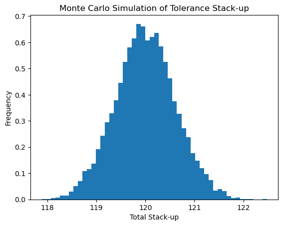
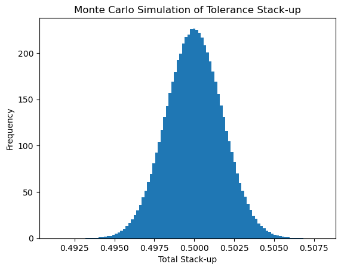
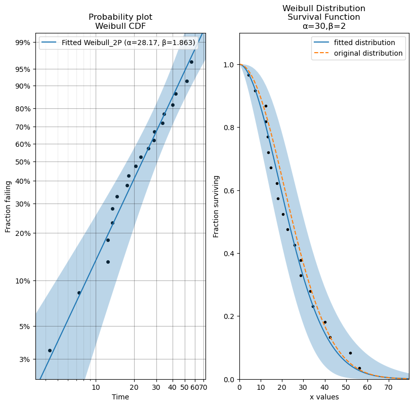

<a href="https://colab.research.google.com/github/huyunwei/robust/blob/main/robust.ipynb" target="_parent"></a>

# Robust Design
## Tolerance Analysis
### Monte Carlo Simulation   

Monte Carlo simulation is a useful method for performing tolerance stack-up analysis. This method relies on statistical sampling to obtain a numerical result.  

Here's a simple example of using Monte Carlo simulation to perform tolerance stack-up analysis. Suppose we have a system with three components, each with its own nominal dimension and tolerance.  

We'll create a Python script to perform 10,000 simulations and understand the distribution of the total stack-up.  

This script defines the nominal dimensions and tolerances of the components and then simulates the total stack-up using random numbers from a normal distribution with means equal to the nominal dimensions and standard deviations equal to the tolerances.

The resulting histogram shows the distribution of the total stack-up over the simulations, which helps in understanding the variability in the system due to the tolerances of the individual components.

```python
import random
import matplotlib.pyplot as plt

def monte_carlo_simulation(num_simulations):
    # Nominal dimensions and tolerances for three components
    nominal_dimensions = [50, 50, 20]
    tolerances = [0.5, 0.3, 0.2]

    # List to store the total stack-up for each simulation
    total_stack_ups = []

    # Perform simulations
    for _ in range(num_simulations):
        total_stack_up = 0
        for nominal, tolerance in zip(nominal_dimensions, tolerances):
            total_stack_up += random.gauss(nominal, tolerance)
        total_stack_ups.append(total_stack_up)

    return total_stack_ups

# Number of simulations
num_simulations = 10000

# Perform Monte Carlo simulation
total_stack_ups = monte_carlo_simulation(num_simulations)

# Plot histogram
plt.hist(total_stack_ups, bins=50, density=True)
plt.xlabel('Total Stack-up')
plt.ylabel('Frequency')
plt.title('Monte Carlo Simulation of Tolerance Stack-up')
plt.show()
```

    

    

```python
import numpy as np
import pandas as pd
from io import StringIO
df_csv = """X,mu,sigma
B1, 50, 0.5
B2, 20, 01
B3, 30, 0.2
E, 100.1, 0.3
"""
df_X = pd.read_csv(StringIO(df_csv))
df_X
```

<div>
<style scoped>
    .dataframe tbody tr th:only-of-type {
        vertical-align: middle;
    }

    .dataframe tbody tr th {
        vertical-align: top;
    }

    .dataframe thead th {
        text-align: right;
    }
</style>
<table border="1" class="dataframe">
  <thead>
    <tr style="text-align: right;">
      <th></th>
      <th>X</th>
      <th>mu</th>
      <th>sigma</th>
    </tr>
  </thead>
  <tbody>
    <tr>
      <th>0</th>
      <td>B1</td>
      <td>50.0</td>
      <td>0.5</td>
    </tr>
    <tr>
      <th>1</th>
      <td>B2</td>
      <td>20.0</td>
      <td>1.0</td>
    </tr>
    <tr>
      <th>2</th>
      <td>B3</td>
      <td>30.0</td>
      <td>0.2</td>
    </tr>
    <tr>
      <th>3</th>
      <td>E</td>
      <td>100.1</td>
      <td>0.3</td>
    </tr>
  </tbody>
</table>
</div>

```python
N_SIM = int(1e6)
df=pd.DataFrame()
for i in range(df_X.shape[0]):
  df[df_X['X'][i]] = np.random.normal(df_X.mu[i], df_X.sigma[i], N_SIM)

df
```

<div>
<style scoped>
    .dataframe tbody tr th:only-of-type {
        vertical-align: middle;
    }

    .dataframe tbody tr th {
        vertical-align: top;
    }

    .dataframe thead th {
        text-align: right;
    }
</style>
<table border="1" class="dataframe">
  <thead>
    <tr style="text-align: right;">
      <th></th>
      <th>B1</th>
      <th>B2</th>
      <th>B3</th>
      <th>E</th>
    </tr>
  </thead>
  <tbody>
    <tr>
      <th>0</th>
      <td>49.682194</td>
      <td>20.080506</td>
      <td>29.988820</td>
      <td>100.122377</td>
    </tr>
    <tr>
      <th>1</th>
      <td>49.361609</td>
      <td>19.662492</td>
      <td>30.402340</td>
      <td>100.437593</td>
    </tr>
    <tr>
      <th>2</th>
      <td>49.909190</td>
      <td>18.336797</td>
      <td>30.043326</td>
      <td>100.141565</td>
    </tr>
    <tr>
      <th>3</th>
      <td>49.713744</td>
      <td>21.197834</td>
      <td>29.875461</td>
      <td>100.014530</td>
    </tr>
    <tr>
      <th>4</th>
      <td>50.042469</td>
      <td>21.025908</td>
      <td>30.086222</td>
      <td>99.367449</td>
    </tr>
    <tr>
      <th>...</th>
      <td>...</td>
      <td>...</td>
      <td>...</td>
      <td>...</td>
    </tr>
    <tr>
      <th>999995</th>
      <td>49.881945</td>
      <td>20.838186</td>
      <td>30.066566</td>
      <td>100.309996</td>
    </tr>
    <tr>
      <th>999996</th>
      <td>50.182431</td>
      <td>20.687323</td>
      <td>30.056847</td>
      <td>100.166842</td>
    </tr>
    <tr>
      <th>999997</th>
      <td>49.539705</td>
      <td>19.886916</td>
      <td>30.122089</td>
      <td>100.332951</td>
    </tr>
    <tr>
      <th>999998</th>
      <td>49.684840</td>
      <td>18.446911</td>
      <td>30.016666</td>
      <td>99.924055</td>
    </tr>
    <tr>
      <th>999999</th>
      <td>49.986381</td>
      <td>19.859883</td>
      <td>30.178253</td>
      <td>99.620995</td>
    </tr>
  </tbody>
</table>
<p>1000000 rows × 4 columns</p>
</div>

```python
transf = 'Gap = E - B1 - B2 - B3'
df = df.eval(transf)
df.describe(percentiles=[.01, .05, .25, .5, .75, .95, .99]  )
```

<div>
<style scoped>
    .dataframe tbody tr th:only-of-type {
        vertical-align: middle;
    }

    .dataframe tbody tr th {
        vertical-align: top;
    }

    .dataframe thead th {
        text-align: right;
    }
</style>
<table border="1" class="dataframe">
  <thead>
    <tr style="text-align: right;">
      <th></th>
      <th>B1</th>
      <th>B2</th>
      <th>B3</th>
      <th>E</th>
      <th>Gap</th>
    </tr>
  </thead>
  <tbody>
    <tr>
      <th>count</th>
      <td>1000000.000000</td>
      <td>1000000.000000</td>
      <td>1000000.000000</td>
      <td>1000000.000000</td>
      <td>1000000.000000</td>
    </tr>
    <tr>
      <th>mean</th>
      <td>50.000529</td>
      <td>20.002766</td>
      <td>29.999912</td>
      <td>100.099926</td>
      <td>0.096718</td>
    </tr>
    <tr>
      <th>std</th>
      <td>0.499832</td>
      <td>1.000627</td>
      <td>0.199731</td>
      <td>0.300073</td>
      <td>1.175749</td>
    </tr>
    <tr>
      <th>min</th>
      <td>47.561451</td>
      <td>15.532944</td>
      <td>29.037477</td>
      <td>98.645485</td>
      <td>-5.741757</td>
    </tr>
    <tr>
      <th>1%</th>
      <td>48.839585</td>
      <td>17.674704</td>
      <td>29.536332</td>
      <td>99.400745</td>
      <td>-2.639941</td>
    </tr>
    <tr>
      <th>5%</th>
      <td>49.177735</td>
      <td>18.356529</td>
      <td>29.671460</td>
      <td>99.606017</td>
      <td>-1.838023</td>
    </tr>
    <tr>
      <th>25%</th>
      <td>49.663011</td>
      <td>19.326471</td>
      <td>29.865135</td>
      <td>99.897742</td>
      <td>-0.695626</td>
    </tr>
    <tr>
      <th>50%</th>
      <td>50.000474</td>
      <td>20.003475</td>
      <td>29.999805</td>
      <td>100.100119</td>
      <td>0.097069</td>
    </tr>
    <tr>
      <th>75%</th>
      <td>50.337725</td>
      <td>20.677318</td>
      <td>30.134817</td>
      <td>100.302226</td>
      <td>0.889853</td>
    </tr>
    <tr>
      <th>95%</th>
      <td>50.822498</td>
      <td>21.648804</td>
      <td>30.328207</td>
      <td>100.592782</td>
      <td>2.029715</td>
    </tr>
    <tr>
      <th>99%</th>
      <td>51.160415</td>
      <td>22.327225</td>
      <td>30.465154</td>
      <td>100.797557</td>
      <td>2.828577</td>
    </tr>
    <tr>
      <th>max</th>
      <td>52.377669</td>
      <td>25.115686</td>
      <td>31.009184</td>
      <td>101.589701</td>
      <td>5.733534</td>
    </tr>
  </tbody>
</table>
</div>

```python
np.sqrt(np.sum(np.square(df_X.sigma)))
```

```python
# Plot histogram
plt.hist(df.Gap, bins=100, density=True)
plt.xlabel('Total Stack-up')
plt.ylabel('Frequency')
plt.title('Monte Carlo Simulation of Tolerance Stack-up')
plt.show()
```

Fitting a Weibull distribution to right-censored time-to-failure data involves statistical methods to estimate the shape and scale parameters of the distribution. Libraries like scipy provide optimization methods for parameter estimation.

Below is a Python code snippet using scipy.optimize to fit a Weibull distribution to right-censored data. For this example, let's assume we have a data set containing time-to-failure data and some censored data points:

```python
with open("Tol_MC.py") as f: # The with keyword automatically closes the file when you are done
    print(f.read())
```

    # Monte Carlo Simulation for Tolerance Stack Up Analysis
    import numpy as np
    import pandas as pd
    from io import StringIO
    
    def get_dfX(path_x):
        try:
            df_X = pd.read_csv(path_x)
            df_X['max'] = df_X['nominal'] + df_X['upper_tol']
            df_X['min'] = df_X['nominal'] + df_X['lower_tol']
            df_X['mean'] = (df_X['max'] + df_X['min']) / 2
            df_X['std'] = (df_X['max'] - df_X['min']) / 2 / df_X['sigma_level']
            return df_X
        except:
            print("Cannot get the parameters for X")
            return None
    
    def mc_tol(df_X, transf, N_SIM):
        df = pd.DataFrame()
        for i in range(df_X.shape[0]):
            df[df_X['name'][i]] = np.random.normal(df_X['mean'][i], df_X['std'][i], N_SIM)
        df = df.eval(transf)
        return df

```python
from Tol_MC import * 
df_X = get_dfX("resistors.csv")
df_X
```

<div>
<style scoped>
    .dataframe tbody tr th:only-of-type {
        vertical-align: middle;
    }

    .dataframe tbody tr th {
        vertical-align: top;
    }

    .dataframe thead th {
        text-align: right;
    }
</style>
<table border="1" class="dataframe">
  <thead>
    <tr style="text-align: right;">
      <th></th>
      <th>name</th>
      <th>nominal</th>
      <th>upper_tol</th>
      <th>lower_tol</th>
      <th>sigma_level</th>
      <th>max</th>
      <th>min</th>
      <th>mean</th>
      <th>std</th>
    </tr>
  </thead>
  <tbody>
    <tr>
      <th>0</th>
      <td>R1</td>
      <td>1</td>
      <td>0.02</td>
      <td>-0.02</td>
      <td>4</td>
      <td>1.02</td>
      <td>0.98</td>
      <td>1.0</td>
      <td>0.005</td>
    </tr>
    <tr>
      <th>1</th>
      <td>R2</td>
      <td>1</td>
      <td>0.02</td>
      <td>-0.02</td>
      <td>4</td>
      <td>1.02</td>
      <td>0.98</td>
      <td>1.0</td>
      <td>0.005</td>
    </tr>
  </tbody>
</table>
</div>

```python
transf = "G = R1 / (R1 + R2)"
N_SIM = int(1e6)
df = mc_tol(df_X, transf, N_SIM)
df.describe()
```

<div>
<style scoped>
    .dataframe tbody tr th:only-of-type {
        vertical-align: middle;
    }

    .dataframe tbody tr th {
        vertical-align: top;
    }

    .dataframe thead th {
        text-align: right;
    }
</style>
<table border="1" class="dataframe">
  <thead>
    <tr style="text-align: right;">
      <th></th>
      <th>R1</th>
      <th>R2</th>
      <th>G</th>
    </tr>
  </thead>
  <tbody>
    <tr>
      <th>count</th>
      <td>1000000.000000</td>
      <td>1000000.000000</td>
      <td>1000000.000000</td>
    </tr>
    <tr>
      <th>mean</th>
      <td>1.000001</td>
      <td>0.999994</td>
      <td>0.500002</td>
    </tr>
    <tr>
      <th>std</th>
      <td>0.005003</td>
      <td>0.005008</td>
      <td>0.001769</td>
    </tr>
    <tr>
      <th>min</th>
      <td>0.974658</td>
      <td>0.976601</td>
      <td>0.491139</td>
    </tr>
    <tr>
      <th>25%</th>
      <td>0.996626</td>
      <td>0.996619</td>
      <td>0.498807</td>
    </tr>
    <tr>
      <th>50%</th>
      <td>0.999998</td>
      <td>1.000004</td>
      <td>0.500000</td>
    </tr>
    <tr>
      <th>75%</th>
      <td>1.003377</td>
      <td>1.003368</td>
      <td>0.501195</td>
    </tr>
    <tr>
      <th>max</th>
      <td>1.022470</td>
      <td>1.025071</td>
      <td>0.508013</td>
    </tr>
  </tbody>
</table>
</div>

```python
# Plot histogram
plt.hist(df.G, bins=100, density=True)
plt.xlabel('Total Stack-up')
plt.ylabel('Frequency')
plt.title('Monte Carlo Simulation of Tolerance Stack-up')
plt.show()
```

    

    

```python
#Compare simulated 
0.005*np.sqrt(2)/4/df.G.std()
```

    0.9992368981938187

```python
from scipy.optimize import minimize
import numpy as np

def weibull_pdf(x, shape, scale):
    return (shape / scale) * ((x / scale) ** (shape - 1)) * np.exp(-((x / scale) ** shape))

def weibull_log_likelihood(params, data, censored_data):
    shape, scale = params
    # Calculate the log-likelihood for non-censored (failed) data
    log_likelihood = np.sum(np.log(weibull_pdf(data, shape, scale)))
    # For right-censored data, the log-likelihood is calculated using the survival function: 1 - CDF
    log_likelihood += np.sum(-(shape / scale) * ((censored_data / scale) ** shape))
    # We return the negative log-likelihood because scipy's "minimize" seeks to find the minimum value of the given function
    return -log_likelihood

# Example time-to-failure data
data = np.array([10, 35, 50, 70])
# Example right-censored data
censored_data = np.array([80, 90])

# Initial guesses for shape and scale parameters
initial_guess = [1.3, 50]

# Optimization to fit Weibull distribution
result = minimize(weibull_log_likelihood, initial_guess, args=(data, censored_data), bounds=[(0.01, 10), (0.01, 100)])

# Resulting shape and scale parameters
shape, scale = result.x

print(f"Shape parameter: {shape}")
print(f"Scale parameter: {scale}")
```

    Shape parameter: 1.8012462759576051
    Scale parameter: 48.0148003624413

```python
from lifelines import WeibullFitter
from scipy.special import gamma

# Time to event (either failure or censoring)
durations = [10, 35, 50, 70, 80, 90]

# Event indicator: 1 if the event is observed (failure), 0 if data is censored
event_observed = [1, 1, 1, 1, 0, 0]

# Initialize the fitter
wf = WeibullFitter()

# Fit the data
wf.fit(durations, event_observed=event_observed)

# Print the summary
wf.print_summary()

# You can access the parameters using the following attributes
print("Shape parameter (rho_):", wf.rho_)
print("Scale parameter (lambda_):", wf.lambda_)

# Calculate MTTF
mttf = wf.lambda_ * gamma(1 + 1/wf.rho_)
print(f"Estimated MTTF: {mttf}")
```

<div>
<style scoped>
    .dataframe tbody tr th:only-of-type {
        vertical-align: middle;
    }

    .dataframe tbody tr th {
        vertical-align: top;
    }

    .dataframe thead th {
        text-align: right;
    }
</style>
<table border="1" class="dataframe">
  <tbody>
    <tr>
      <th>model</th>
      <td>lifelines.WeibullFitter</td>
    </tr>
    <tr>
      <th>number of observations</th>
      <td>6</td>
    </tr>
    <tr>
      <th>number of events observed</th>
      <td>4</td>
    </tr>
    <tr>
      <th>log-likelihood</th>
      <td>-21.48</td>
    </tr>
    <tr>
      <th>hypothesis</th>
      <td>lambda_ != 1, rho_ != 1</td>
    </tr>
  </tbody>
</table>
</div><table border="1" class="dataframe">
  <thead>
    <tr style="text-align: right;">
      <th style="min-width: 12px;"></th>
      <th style="min-width: 12px;">coef</th>
      <th style="min-width: 12px;">se(coef)</th>
      <th style="min-width: 12px;">coef lower 95%</th>
      <th style="min-width: 12px;">coef upper 95%</th>
      <th style="min-width: 12px;">cmp to</th>
      <th style="min-width: 12px;">z</th>
      <th style="min-width: 12px;">p</th>
      <th style="min-width: 12px;">-log2(p)</th>
    </tr>
  </thead>
  <tbody>
    <tr>
      <th>lambda_</th>
      <td>78.64</td>
      <td>28.87</td>
      <td>22.06</td>
      <td>135.22</td>
      <td>1.00</td>
      <td>2.69</td>
      <td>0.01</td>
      <td>7.13</td>
    </tr>
    <tr>
      <th>rho_</th>
      <td>1.38</td>
      <td>0.62</td>
      <td>0.17</td>
      <td>2.59</td>
      <td>1.00</td>
      <td>0.62</td>
      <td>0.54</td>
      <td>0.90</td>
    </tr>
  </tbody>
</table><br><div>
<style scoped>
    .dataframe tbody tr th:only-of-type {
        vertical-align: middle;
    }

    .dataframe tbody tr th {
        vertical-align: top;
    }

    .dataframe thead th {
        text-align: right;
    }
</style>
<table border="1" class="dataframe">
  <tbody>
    <tr>
      <th>AIC</th>
      <td>46.96</td>
    </tr>
  </tbody>
</table>
</div>

    Shape parameter (rho_): 1.3813143699309725
    Scale parameter (lambda_): 78.64137992312745
    Estimated MTTF: 71.83061360648522

```python
from reliability.Distributions import Weibull_Distribution
from reliability.Fitters import Fit_Weibull_2P
from reliability.Probability_plotting import plot_points
import matplotlib.pyplot as plt

dist = Weibull_Distribution(alpha=30, beta=2)  # creates the distribution object
data = dist.random_samples(20, seed=42)  # draws 20 samples from the distribution. Seeded for repeatability
plt.subplot(121)
fit = Fit_Weibull_2P(failures=data)  # fits a Weibull distribution to the data and generates the probability plot
plt.subplot(122)
fit.distribution.SF(label='fitted distribution')  # uses the distribution object from Fit_Weibull_2P and plots the survival function
dist.SF(label='original distribution', linestyle='--') # plots the survival function of the original distribution
plot_points(failures=data, func='SF')  # overlays the original data on the survival function
plt.legend()
plt.show()
```

    Results from Fit_Weibull_2P (95% CI):
    Analysis method: Maximum Likelihood Estimation (MLE)
    Optimizer: TNC
    Failures / Right censored: 20/0 (0% right censored) 
    
    Parameter  Point Estimate  Standard Error  Lower CI  Upper CI
        Alpha         28.1696         3.57032   21.9733   36.1131
         Beta         1.86308         0.32449   1.32428   2.62111 
    
    Goodness of fit    Value
     Log-likelihood -79.5482
               AICc  163.802
                BIC  165.088
                 AD  0.83728 
    

    

    

```python
# import altair with an abbreviated alias
import altair as alt
alt.renderers.enable('mimetype')

# load a sample dataset as a pandas DataFrame
from vega_datasets import data
cars = data.cars()

# make the chart
alt.Chart(cars).mark_point().encode(
    x='Horsepower',
    y='Miles_per_Gallon',
    color='Origin',
).interactive()
```

    <VegaLite 5 object>
    
    If you see this message, it means the renderer has not been properly enabled
    for the frontend that you are using. For more information, see
    https://altair-viz.github.io/user_guide/display_frontends.html#troubleshooting

