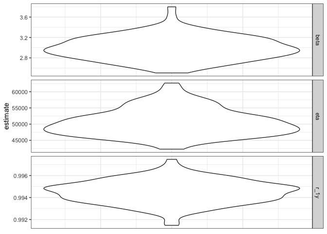

# Simulation for Weibull Analysis

## Problem Statement

The script below is trying to generate warranty return data for a
product that follows a Weibull time-to-failure distribution.

## Assumptions

We further assume that: - \`shipment per day\` is constant, and there is
no delay in deploy in the field.

\- return data is immediate and accurate

\- A serial number will be genreated for each shipped product.

The function will take the following input:

\- Weibull parameters, eta and beta

\- ship_date_start, ship_date_end

\- report_stop_date (either end of warranty, or end of analysis period)

\- shipment per day

All dates will be in \`ymd\` format

## Generate Simulated data set

``` r
return_gen <- function(eta, 
                       beta, 
                       ship_date_start, 
                       ship_date_end, 
                       shipment_per_day, 
                       stop_date
                       ){
  date_seriers = seq.Date(ymd(ship_date_start), ymd(ship_date_end), "days")
  stop_date = ymd(stop_date)
  n_days = length(date_seriers)
  data <- tibble(ship_date = rep(date_seriers, shipment_per_day),
                 time2failure = rweibull(n_days * shipment_per_day, beta, eta),
  ) %>% 
    mutate(fail_date = ship_date + duration(hours = time2failure),
          status = if_else(fail_date > stop_date, "S", "F"),
          return_date = if_else(fail_date > stop_date, as.Date(stop_date), as.Date(fail_date)),
          reported_hours = as.numeric(interval(ship_date, return_date), "hours")) %>% 
    arrange(ship_date) %>% 
    mutate(SN = str_c(as.character(ship_date), 
                      rep(str_pad(1:shipment_per_day, 6, pad="0"), n_days), 
                      sep="-")
           )
          
    return(data)
}

data <- return_gen(eta = 50000, 
                   beta = 3,
                   ship_date_start = 20210101, 
                   ship_date_end = 20211231,
                   shipment_per_day = 10,
                   stop_date = 20230630
)

data
```

    # A tibble: 3,650 × 7
       ship_date  time2failure fail_date           status return_date reported_hours
       <date>            <dbl> <dttm>              <chr>  <date>               <dbl>
     1 2021-01-01       60597. 2027-11-30 20:54:02 S      2023-06-30           21840
     2 2021-01-01       68737. 2028-11-04 00:57:08 S      2023-06-30           21840
     3 2021-01-01       27217. 2024-02-09 01:22:32 S      2023-06-30           21840
     4 2021-01-01       52015. 2026-12-08 07:07:46 S      2023-06-30           21840
     5 2021-01-01       35262. 2025-01-09 05:45:42 S      2023-06-30           21840
     6 2021-01-01       53024. 2027-01-19 08:11:53 S      2023-06-30           21840
     7 2021-01-01       20124. 2023-04-19 11:51:06 F      2023-04-19           20112
     8 2021-01-01       35664. 2025-01-26 00:25:20 S      2023-06-30           21840
     9 2021-01-01       52398. 2026-12-24 05:59:03 S      2023-06-30           21840
    10 2021-01-01       38422. 2025-05-20 21:59:48 S      2023-06-30           21840
    # ℹ 3,640 more rows
    # ℹ 1 more variable: SN <chr>

## Fit Weibull to simualted data

Note that the \`echo = FALSE\` parameter was added to the code chunk to
prevent printing of the R code that generated the plot.

We fit the Weibull distribution with the simulated data using the
\`Survival\` package.

> survreg’s scale parameter = 1/(rweibull shape parameter)  
> survreg’s intercept = log(rweibull scale parameter)

``` r
library(survival)


weib_fit <- function (surv_data){
  test_fit <- survival::survreg(Surv(time, status) ~ 1,
                                data = surv_data,
                                dist = "weibull"
                                )
  beta_fit = 1 / (test_fit$scale)
  eta_fit = exp(test_fit$coefficients[[1]])
  return(tibble(beta_fit, eta_fit))
}

surv_data <- data %>% 
  mutate(censored = if_else(status == "F", 1, 0)) %>% 
  select(time = reported_hours, status = censored)

fitted <- weib_fit(surv_data)
print(fitted)
```

    # A tibble: 1 × 2
      beta_fit eta_fit
         <dbl>   <dbl>
    1     2.95  51306.

## Replicates

We repeat the simulation for several times to see how well the regession
fit the underlying model.

``` r
N_SIM = 100
fitted = tibble(id=as.integer(), beta_fit = as.numeric(), eta_fit = as.numeric())
for (i in 1:N_SIM){
  data <- return_gen(eta = 50000, 
                   beta = 3,
                   ship_date_start = 20210101, 
                   ship_date_end = 20211231,
                   shipment_per_day = 10,
                   stop_date = 20230630 )
  surv_data <- data %>% 
  mutate(censored = if_else(status == "F", 1, 0)) %>% 
  select(time = reported_hours, status = censored)
  fitted <- fitted %>% add_row(id = i, weib_fit(surv_data))
}
print(fitted)
```

    # A tibble: 100 × 3
          id beta_fit eta_fit
       <int>    <dbl>   <dbl>
     1     1     3.44  44029.
     2     2     3.36  44140.
     3     3     3.05  46862.
     4     4     3.02  51108.
     5     5     2.82  52766.
     6     6     3.11  46979.
     7     7     2.95  49845.
     8     8     2.92  50559.
     9     9     2.99  50948.
    10    10     2.64  58571.
    # ℹ 90 more rows

``` r
fitted  %>% 
  mutate(r_1y = exp(-(8760/eta_fit)^beta_fit) ) %>% 
  select(eta = eta_fit, beta = beta_fit, r_1y) %>% 
  pivot_longer(cols=(c("eta", "beta", "r_1y")),
               names_to = "parameter", values_to = "estimate") %>% 
  ggplot(aes(0, y=estimate)) + facet_grid(rows = "parameter", scales = "free_y") +
           geom_violin() + theme_bw() +
           theme(axis.title.x=element_blank(),
                 axis.text.x=element_blank(),
                 axis.ticks.x=element_blank()) 
```


